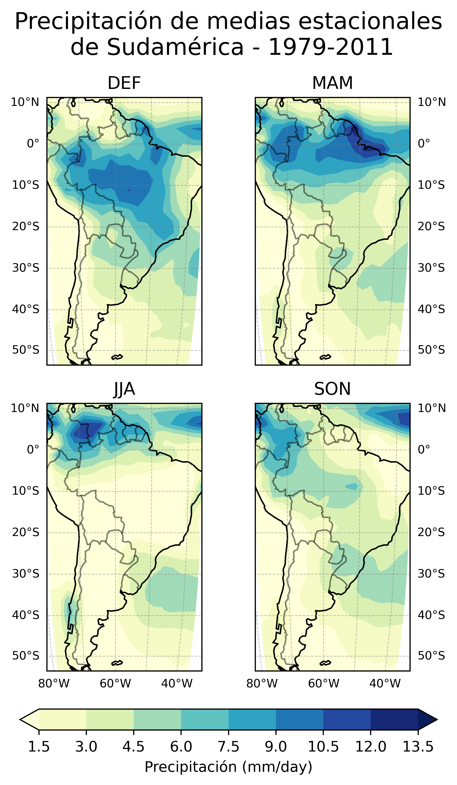
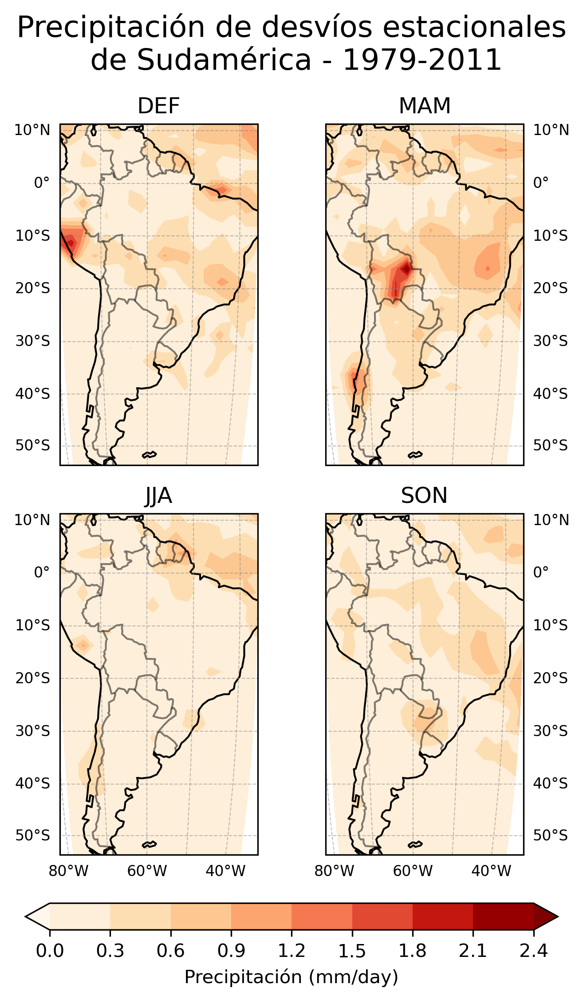
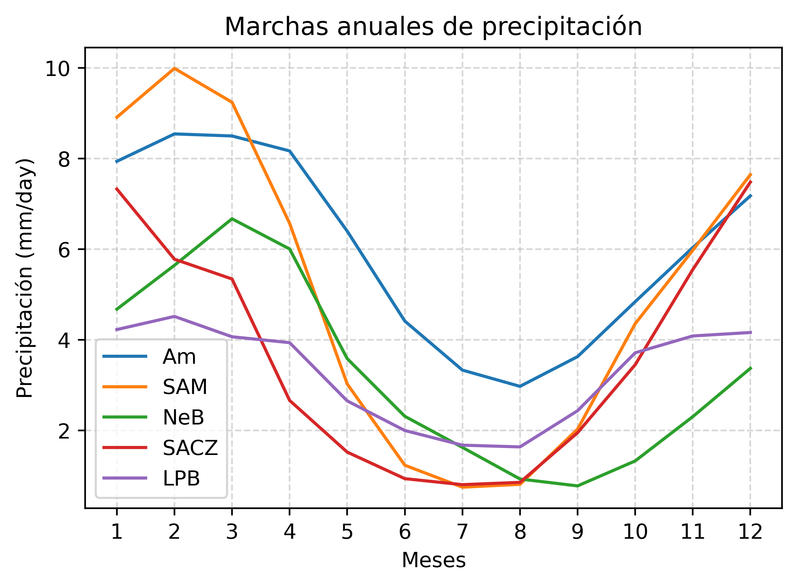

# Análisis Espacial y Temporal de Precipitaciones en Sudamérica

Proyecto desarrollado en el marco del **Laboratorio de Procesamiento de Información Meteorológica** (Licenciatura en Ciencias de la Atmósfera, FCEN - UBA).

El objetivo principal es el procesamiento, análisis estadístico y visualización de datos grillados multidimensionales de precipitación para caracterizar la variabilidad climática espacial y estacional en la región sudamericana.

---

## Objetivos y Alcance

- **Lectura y procesamiento de datos multidimensionales:** Manipulación de archivos en formato **NetCDF** provistos por la **NOAA**.
- **Análisis estadístico regional:** Cálculo y comparación de campos medios y desvíos estándar de precipitación a escala estacional y por subregiones.
- **Visualización geoespacial:** Generación de mapas climáticos y gráficos de diagnóstico para evaluar la distribución espacial y temporal de las lluvias.

---

## Herramientas y Librerías

El análisis se implementó en **Python**, utilizando el siguiente stack científico:

- **`netCDF4`**: Extracción y manejo de conjuntos de datos multidimensionales.
- **`pandas` & `numpy`**: Tratamiento numérico, estructuración y cálculos estadísticos matriciales.
- **`cartopy`**: Proyecciones cartográficas y mapeo geoespacial de variables climáticas.
- **`matplotlib`**: Generación de figuras, campos de contorno y gráficos de análisis estacional.

---

##  Fuente de los Datos y Descarga

Los datos grillados de precipitación fueron obtenidos del catálogo de la **NOAA Physical Sciences Laboratory (PSL)**:

- **Dataset:** CPC Merged Analysis of Precipitation (CMAP)
- **Acceso web:** [NOAA PSL CMAP Data](https://psl.noaa.gov/data/gridded/data.cmap.html)
- **Pasos para la obtención del dato:**
  1. En el catálogo de la página se presentan 3 opciones de estadísticas; seleccionar la fila correspondiente a **Mean** (TimeScale: *Monthly*).
  2. Ingresar a las opciones de descarga y seleccionar el archivo NetCDF: **`precip.mon.mean.nc`**.

---

## Resultados y Visualizaciones

Al ejecutar el código se generan automáticamente las figuras cartográficas y un archivo `.txt` con los resúmenes estadísticos numéricos (el cual no se incluye como imagen debido al volumen de datos que contiene).

A continuación se presentan las salidas gráficas generadas:

### 1. Campos Medios de Precipitación
Distribución espacial media acumulada sobre Sudamérica para identificar lugares y variaciones estacionales.

### 2. Dispersión y Desvíos Estándar
Distribución espacial de la variabilidad y dispersión interanual de las lluvias en las diferentes subregiones.

### 3. Ciclo Anual (Marcha de Precipitación)
Evolución temporal y caracterización del ciclo estacional de las precipitaciones en la región analizada.

---

## Estructura del Repositorio

- `data/`: Información sobre fuentes y especificaciones de los datos de NOAA utilizados.
- `notebooks/` (o `scripts/`): Código fuente con el preprocesamiento, cálculo de estadísticas y generación de figuras.
- `figures/`: Salidas gráficas exportadas (mapas de precipitación media, desvíos y marcha anual).
